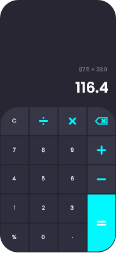

# CALCULATOR APP
This is a simple calculator app that:
* lets you perform basic operations on numbers and 
* shows an error when input is not as expected.

I am a beginner in React JS and this project helped me start building apps on my own. 

I designed the interface of this app using Adobe XD first and then decided to implement it. The design is at:
https://www.behance.net/gallery/126657883/Calculator

## Deployed At:
https://calculator-anushkachauhan.surge.sh

